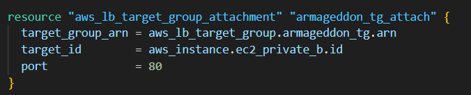
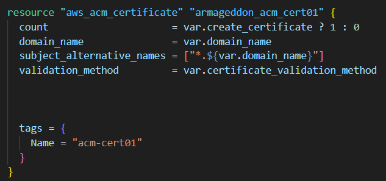
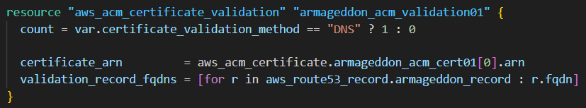
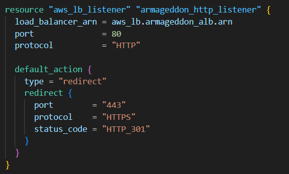
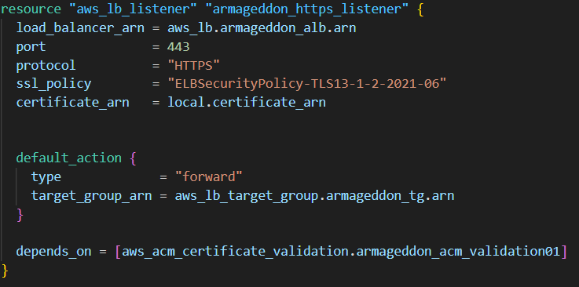
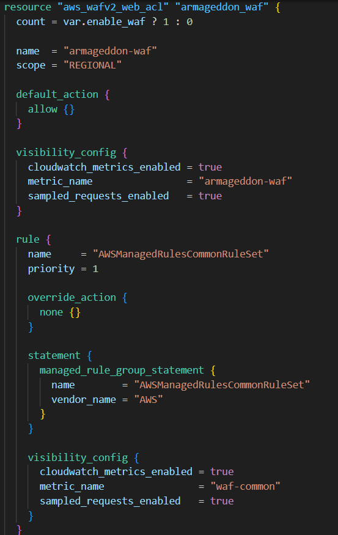

## Links

[00-Armageddon-Notes-Main](00-Armageddon-Notes-Main.md)

---

# 012-cert

---


# ACM Certificate Lookup (CloudFront)

## Purpose

Find an existing **ISSUED** ACM certificate for:

```text
var.domain_name
```

---

## Why `provider = aws.use1` Matters

CloudFront requires the ACM certificate to be in:

```text
us-east-1
```

So you're intentionally looking it up in **us-east-1**, even if your main infrastructure is elsewhere.

---

## most_recent = True

If multiple certificates match the domain:

- Select the newest one.

---

## try(..., null)

If lookup fails:

- `local.cf_cert_arn` becomes `null`
- Prevents immediate Terraform crash

CloudFront will still fail later if a cert is required and gets null.

---

# CloudFront Distribution


Creates a **CloudFront distribution** (CDN / edge entry point).

- `enabled = true`
- `is_ipv6_enabled = true`

---

# Origin Configuration


## Origin Domain

```text
origin.${var.domain_name}
```

Typically a Route53 record pointing to an ALB.

---

## custom_origin_config

Used for non-S3 origins (ALB / EC2 / NGINX).

### Settings

- `origin_protocol_policy = https-only`
- Only allow TLS 1.2 to origin

CloudFront → Origin always encrypted.

---

## Origin Cloaking (Secret Header)

```text
custom_header:
  King-Iron-Fist: <random>
```

CloudFront adds this header to every origin request.

Your ALB can enforce:

- Only forward if header matches
- Block direct-origin bypass attempts

---

# Cache Behaviors

CloudFront has:

- `default_cache_behavior` → catch-all
- `ordered_cache_behavior` → path-specific overrides

Ordered behaviors are evaluated first.

---


# Default Cache Behavior (Dynamic Traffic)

## Viewer Protocol

- HTTP → Redirect to HTTPS

---

## Methods

- Allowed: All common HTTP methods (API friendly)
- Cached: GET, HEAD only

---

## Cache Policy

```text
Managed-CachingDisabled
```

Effectively:

- No CDN caching
- TTL = 0

Typical for dynamic APIs.

---

## Origin Request Policy

```text
Managed-AllViewerExceptHostHeader
```

- Forwards most headers/cookies/query strings
- Does NOT forward Host header

Avoids host-header confusion at origin.

---


# Public Endpoint Path (Cacheable)

This specific path:

- Can be cached

---

## Cache Policy

```text
UseOriginCacheControlHeaders
```

CloudFront respects:

```text
Cache-Control
```

From origin (e.g., max-age, s-maxage).

---

## Origin Request Policy

Custom:

```text
armageddon_orp_static01
```

Typically forwards fewer headers → better cache hit rate.

---


# Other API Paths (Not Cached)

All other API calls:

- Not cached
- Same forwarding behavior as default

---



# Static Files Behavior

Custom cache policy:

- Usually long TTL
- Optimized cache key

Response headers policy:

- Likely adds security headers
- May control caching behavior

(Depends on your specific policy definition.)

---



# WAF Association

Attaches WAFv2 Web ACL to distribution.

Inspection happens at:

- CloudFront edge

---



# Alternate Domain Names (Aliases)

Distribution responds to:

- `example.com`
- `app.example.com`

Requires:

- DNS records pointing to distribution
- ACM certificate covering both names

---



# Viewer Certificate (TLS)

Uses ACM certificate (must be in **us-east-1**).

### Settings

- `ssl_support_method = sni-only`
- `minimum_protocol_version = TLSv1.2_2021`

Modern TLS configuration.

---



# Geo Restrictions

No country blocking configured.

All countries allowed.

---



# Managed Policies Lookup (Data Sources)

Fetching IDs of AWS-managed policies by name.

This allows you to:

- Reference them in behaviors
- Avoid recreating them

Examples:

- Managed cache policies
- Managed origin request policies
- Managed response headers policies

---

# Full Traffic Flow

```text
User
   ↓
CloudFront (Edge)
   ↓ (WAF Inspection)
Secret Header Added
   ↓
ALB (443)
   ↓
Private EC2
```

---

# Design Patterns Used

|Pattern|Purpose|
|---|---|
|us-east-1 ACM lookup|Required for CloudFront|
|Origin cloaking header|Prevent direct-origin bypass|
|Managed caching disabled|API-safe behavior|
|Path-based caching|Optimize static vs dynamic|
|WAF at edge|Block threats early|
|SNI-only TLS|Modern certificate handling|
|Policy data sources|Avoid duplication|

---

# Mental Model

- Certificate must live in us-east-1
- CloudFront enforces HTTPS at edge
- Secret header protects origin
- Default = no caching (API-safe)
- Static paths cached separately
- WAF protects before traffic hits origin
