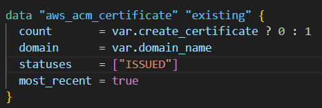
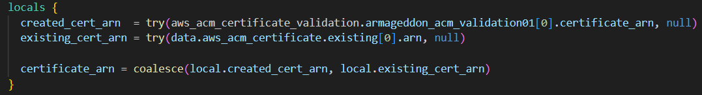
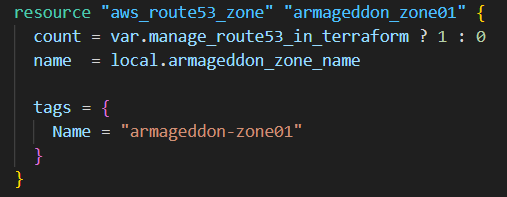
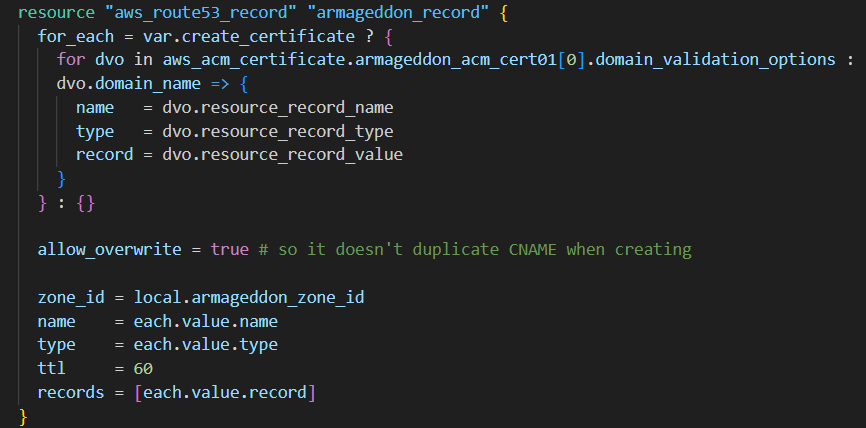
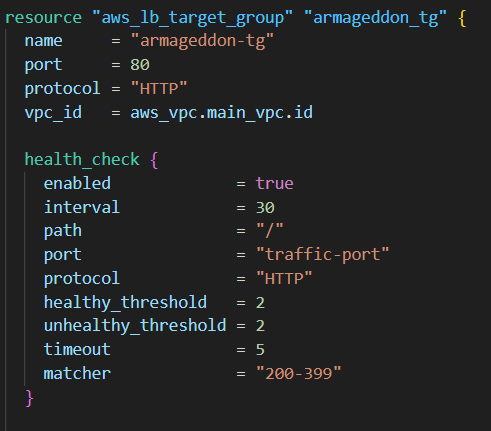

## Links

[[00-Armageddon-Notes-Main](00-Armageddon-Notes-Main.md)]

---

# 016-tgw-tokyo

---


# Tokyo Transit Gateway (TGW)

## What It Creates

A **Transit Gateway (TGW)** in:

```text
ap-northeast-1 (Tokyo)
```

---

## What It’s For

TGW is a regional Layer 3 router that connects:

- VPCs
- VPNs
- Direct Connect
- Other TGWs (via peering)

---

## Important Outputs

You later use:

```text
aws_ec2_transit_gateway.armageddon_shinjuku_tgw01.id
```

Plus:

- Default association route table ID
- Default propagation route table ID

---



# Tokyo TGW VPC Attachment

## What It Creates

A TGW VPC attachment between:

- Tokyo TGW
- Tokyo VPC (`aws_vpc.main_vpc`)

---

## Why subnet_ids Matter

The subnets listed become the locations where AWS places:

```text
TGW ENIs
```

---

### Current Behavior

```text
aws_subnet.private[*].id
```

Attaches **all private subnets**.

That works, but common best practice:

- Attach 2 subnets
- In 2 different AZs
- For high availability

---

## Result

Tokyo VPC is now connected to the Tokyo TGW.

---



# TGW Peering Attachment (Tokyo → São Paulo)

## What It Creates

A **TGW peering attachment request** from:

- Tokyo TGW
- To São Paulo TGW

---

## peer_transit_gateway_id

Must reference the **São Paulo TGW ID**.

This only works if:

- Both regions are in same Terraform state
- Or imported via `terraform_remote_state`
- Or passed as variable

---

## Important

Peering is not active until:

```text
aws_ec2_transit_gateway_peering_attachment_accepter
```

Runs in São Paulo.

---

# TGW Route (Tokyo Side)

---



## What It Does

Inside Tokyo TGW’s **default association route table**:

Adds:

```text
Destination: 10.80.0.0/16 (São Paulo CIDR)
Target: TGW Peering Attachment
```

---

## Why depends_on Is Used

Terraform might try to create the route before:

- Peering is accepted

This enforces correct ordering.

---

## Key Concept

This is **TGW-level routing**.

Separate from VPC route tables.

---

# VPC Route (Tokyo VPC Side)

---



## What It Does

In a specific Tokyo VPC route table:

Adds:

```text
Destination: 10.80.0.0/16
Target: Transit Gateway
```

---

## Why This Is Required

Without this VPC route:

- Traffic destined for São Paulo
- Never leaves the VPC
- Never reaches TGW

Both layers are required:

|Layer|Route Needed?|
|---|---|
|TGW Route Table|✅ Yes|
|VPC Route Table|✅ Yes|

---

## Big Red Flag

Route table ID is **hard-coded**.

If route table is recreated:

- ID changes
- Terraform breaks
- Traffic fails

---

## Better Pattern

Reference route tables dynamically:

- By tag
- By resource reference
- By data source

Avoid hard-coded IDs.

---



# Why It Was Used

Likely used to:

- Discover the `rtb-...` ID
- Plug into Terraform config

But should be replaced with dynamic lookup.

---

# Full Cross-Region Flow (Tokyo Perspective)

```text
Tokyo EC2
    ↓
Tokyo Subnet Route Table
    ↓ (10.80.0.0/16 → TGW)
Tokyo TGW
    ↓ (Peering)
São Paulo TGW
    ↓
São Paulo VPC
    ↓
São Paulo Resources
```

---

# Architecture Pattern Summary

|Component|Role|
|---|---|
|Tokyo TGW|Regional routing hub|
|VPC Attachment|Connects Tokyo VPC|
|Peering Attachment|Cross-region link|
|TGW Route|Directs traffic to São Paulo|
|VPC Route|Sends traffic to TGW|

---

# Mental Model

- TGW routes ≠ VPC routes
- Both sides must define routes
- Peering must be accepted in other region
- Avoid hard-coded route table IDs
- Multi-region routing requires symmetry
