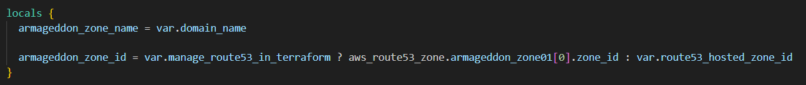

## Links

[00-Armageddon-Notes-Main](00-Armageddon-Notes-Main.md)

---

# 02-Version

---



# Terraform Block – Required Version & Providers

This section defines:

- Terraform CLI version requirement
- Required provider plugins
- Provider source location
- Provider version constraints

---

## Required Version

Terraform will refuse to run this config if your Terraform CLI is **older than 1.5.0**.

This protects you from weird errors if the code uses features that don't exist in older Terraform versions.

### Example

```hcl
terraform {
  required_version = ">= 1.5.0"
}
```

### Why This Matters

|Condition|Result|
|---|---|
|CLI < 1.5.0|Terraform stops execution|
|CLI ≥ 1.5.0|Configuration runs|
|Mixed team versions|Prevents inconsistent behavior|

---

## Required Providers

Declares which provider plugins are needed.

Defined inside the `terraform` block.

### Example Structure

```hcl
terraform {
  required_providers {
    aws = {
      source  = "hashicorp/aws"
      version = ">= 6.0"
    }
  }
}
```

---

## Aws = { ... }

This tells it it's using the AWS provider, and it's calling it `aws`.

This name is how Terraform references the provider internally.

---

## Source = "hashicorp/aws"

This tells Terraform where to download the provider from (the provider's address in the Terraform Registry).

Here it's the official AWS provider maintained under the `hashicorp` namespace.

### Provider Address Format

```text
<namespace>/<provider>
```

|Component|Meaning|
|---|---|
|hashicorp|Organization maintaining provider|
|aws|Provider name|

---

## Version = ">= 6.0"

Terraform will only install/use AWS provider versions **6.0 or newer**.

This is important because provider versions can introduce breaking changes; this pins you away from older versions that may behave differently.

### Version Constraint Reference

| Constraint      | Meaning                     |
| --------------- | --------------------------- |
| `>= 6.0`        | Any version 6.0 or newer    |
| `= 6.2.0`       | Exactly version 6.2.0       |
| `~> 6.0`        | Allows 6.x but not 7.0      |
| `>= 6.0, < 7.0` | Explicit major version lock |

---

## Mental Model

- `required_version` → Controls Terraform CLI version
- `required_providers` → Controls provider plugins
- `source` → Registry location
- `version` → Allowed provider versions

---

## Quick Recall

- Terraform block controls engine + providers
- CLI version mismatch → Terraform refuses to run
- Provider address = `namespace/provider`
- Always constrain provider versions to prevent breaking changes
